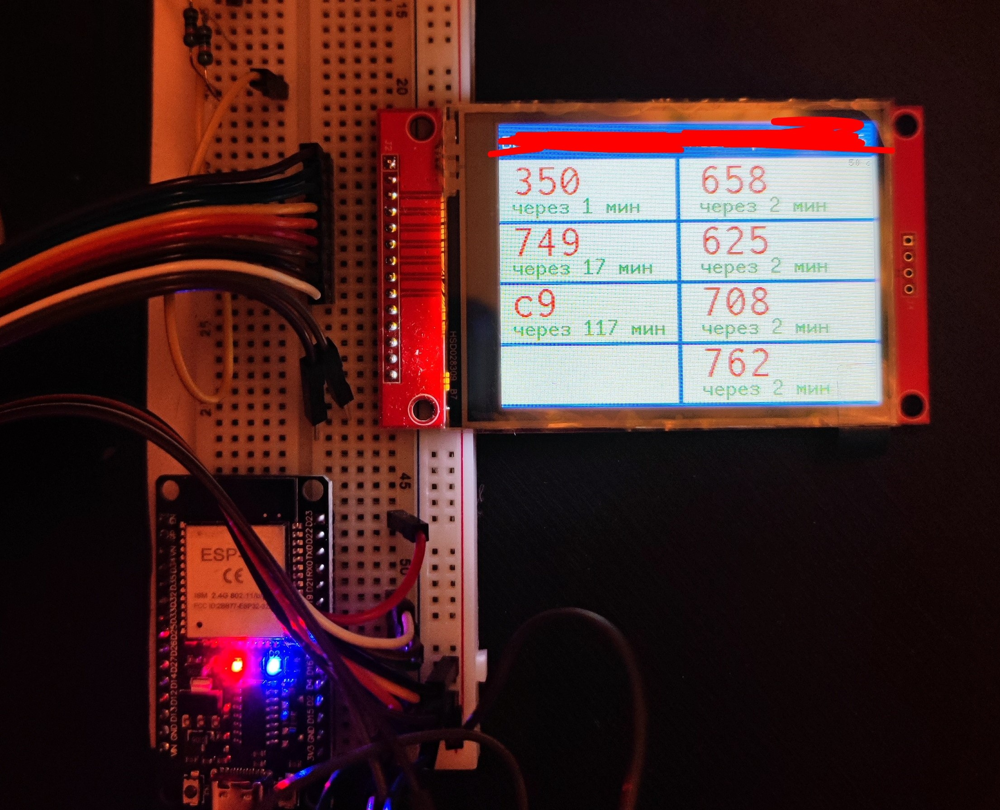

# moscow_bus_display
Простой скетч для вывода на экран расписаний автобусов на двух остановках в Москве  
Разработан для esp32 с дисплеем ILI9341 (альбомная ориентация) с использованием platformio.  
  
Для смены отображаемых остановок необходимо узнать ID остановки в приложении Московский транспорт:  
&nbsp;&nbsp;&nbsp;&nbsp;1. Найти в приложении нужную остановку и выбрать её  
&nbsp;&nbsp;&nbsp;&nbsp;2. "Поделиться" и открыть ссылку в браузере  
&nbsp;&nbsp;&nbsp;&nbsp;3. Скопировать всё что после ".../stop?id="  
&nbsp;&nbsp;&nbsp;&nbsp;4. Перейти в src/main.cpp  
&nbsp;&nbsp;&nbsp;&nbsp;&nbsp;&nbsp;&nbsp;&nbsp;4.1. найти комментарий // Московский транспорт stop_id и заменить id в константе stops  
&nbsp;&nbsp;&nbsp;&nbsp;&nbsp;&nbsp;&nbsp;&nbsp;4.2. Заменить названия остановок в stopNames  